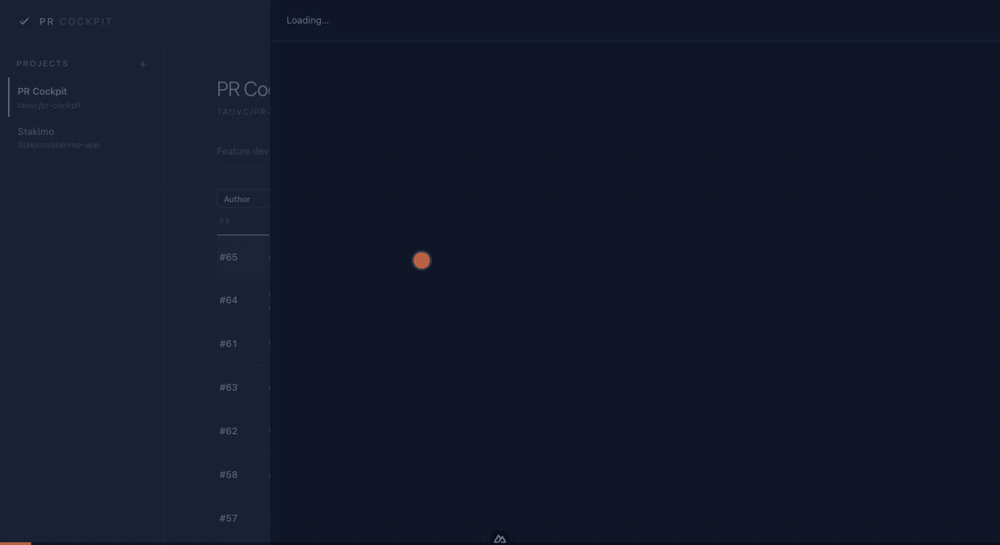

<div align="center">
  
  <h1>PR Cockpit</h1>
  <p><b>用 Claude 或 Codex 批量审一个仓库的 PR，全程在本地。</b><br />
  代码不出本机，跑的是你自己的 Claude/Codex 订阅，<br />
  你不勾选，就不会有任何东西发到 GitHub。</p>
</div>

<p align="center">
  
  
  <a href="https://nuxt.com"></a>
  <a href="https://www.typescriptlang.org"></a>
  <a href="https://github.com/taovc/pr-cockpit/actions/workflows/desktop-release.yml"></a>
  <a href="./LICENSE"></a>
</p>

<div align="center">

[English](README.md) · **中文** · [Français](README.fr.md)

</div>

<div align="center">
  
</div>

## 下载

想快速试一下，用桌面版最省事——不用 clone，不用装工具链。

**[⬇ 下载构建版本](https://github.com/taovc/pr-cockpit/releases)** —— 目前以滚动的 `nightly` 预发布形式提供，`main` 每次推送都会重新构建。

| 平台 | 文件 |
|---|---|
| macOS（Apple 芯片） | `pr-cockpit-<版本>-arm64.dmg` |
| Windows（x64） | `pr-cockpit-<版本>-x64.exe` |
| Linux（x86_64） | `pr-cockpit-<版本>-x86_64.AppImage` |

Intel 芯片的 Mac 目前没有预编译包，请改用[从源码构建](#从源码构建)。

**所有安装包都没有签名**，三个平台首次启动都会有拦截：

- **macOS** 会提示「已损坏」或「来自身份不明的开发者」。清一次隔离标记即可：
  ```bash
  xattr -dr com.apple.quarantine "/Applications/PR Cockpit.app"
  ```
  也可以在访达里右键点应用 → **打开** → 在弹窗里再点一次**打开**。
- **Windows** 会弹 SmartScreen 的「Windows 已保护你的电脑」。点**更多信息** → **仍要运行**。
- **Linux** 需要先给 AppImage 加可执行权限才能启动：
  ```bash
  chmod +x pr-cockpit-*-x86_64.AppImage
  ```

无论哪种装法，都还需要 `gh auth login` 以及 Claude 或 Codex 的登录，应用才能干活——见[前置](#前置)。

## 它是怎么工作的

不再逐个在终端审 PR，也不把修复和新功能开发散落在多个窗口里：把仓库 PR 拉进来 → AI 在隔离 worktree 里审核、复查或修复 → 你在 Web 里把关 findings、对话、diff、push/PR → 对外内容通过 GitHub 落地。每个项目可以选择 Claude 或 Codex，配置自己的模型、力度和审核方法学。

## 功能支持

**PR 工作台与审核**
- 直接拉仓库 PR 列表（`gh pr list` / GraphQL），按作者、PR 状态、审核状态、修复状态、worktree 状态筛选，列表自动轮询刷新
- 右侧 drawer 看 PR 详情（AI 审核 / 修复 / 时间线 / diff），评论与描述 markdown 渲染
- AI 在隔离 git worktree 里只读审核，输出结构化 findings（严重度 + path:line + 问题/详情/修复）+ 需求描述 + 手动测试路径
- 支持按你的勾选和 note 做反馈复审，也支持作者 push 后按最新 commit 复查每条 finding

**人工把关 + 发布**
- 逐条 finding 勾选「发到 PR comment」+ 写 note（note 作为编辑指令融进评论，不原样泄漏）
- 发布前预览（dry-run，可缓存/重新生成）；任意工作语言的 findings 都会转成专业英文 GitHub 评论；行级评论挂到代码行，挂不上的进汇总
- 发布走 `gh api .../reviews`，带 posting 认领和 pending review 自愈，避免并发重复发

**修复 PR**
- 修复 tab 是常驻对话：agent 在 PR worktree 里改代码，但默认不 commit/push
- 「提交并上传」先生成 diff + conventional commit message 预览，用户确认后才 `git add/commit/push`
- 支持停止、继续对话、可展开运行日志、决策卡、ultracode 后台开关和危险命令开关

**Feature 开发与全局助手**
- 项目页有「Feature 开发」tab：输入需求后创建隔离 feature worktree，agent 单段式开发，遇到关键决策用 `ask-user` 卡片让你拍板
- 「开 PR」是显式动作：那一轮放行 push/`gh pr create`，commit message、PR title/body 保持英文
- 右下角全局助手支持项目继承 provider/cwd，也可 `/cd`、`/resume`、`/clear`，用于自由排查和操作

**每项目配置**
- 项目级选择 Claude 或 Codex；review、fix chat、recheck、skill generation、publish reply 都跟随当前 provider，不混用
- Claude 模型来自本地 `claude`，Codex 模型使用预设/默认；effort、Codex Fast/service tier、方法学都可按项目配置
- 多套审核 skill，选一套启用；AI 生成时读取本地仓库文档和架构，生成候选后 diff 对比再启用，绝不覆盖

**安全与一致性**
- 审核 agent 只读：工具层硬拦截 git 写 / 文件改 / 联网 / 危险命令 + 操作契约前置 + skill 体检
- 写代码路径只在隔离 worktree 中运行；push、开 PR、危险命令都需要显式 UI 动作或开关
- 同仓库 git 操作互斥；findings 写入用事务；删除任务同步清 worktree；服务重启会恢复/止损中断任务
- PR 自动化是高风险能力，默认关闭；配置后由服务端轮询复用现有 review/post/fix/push 端点

## 技术栈

Nuxt 4 + @nuxt/ui（Tailwind v4）· better-sqlite3 + drizzle · `@anthropic-ai/claude-agent-sdk` · `@openai/codex-sdk` · 本地 `gh` CLI · Electron 打包（Electron 作为 Node 运行 Nitro server）。

## 前置

两种装法都需要：

- `gh auth login` 已登录——GitHub 的每一次读写都走 GitHub CLI
- Claude provider：本地已登录 `claude`（走订阅）或填 `ANTHROPIC_API_KEY`
- Codex provider：本地 Codex 已登录，或提供 `OPENAI_API_KEY`

只有从源码构建才需要：

- Node ≥ 22、pnpm 9

## 从源码构建

首次从源码运行的分步指南。只是想用的话，直接[下载桌面版](#下载)，不需要任何工具链。精简版见下方「起步」。

**1. 检查前置条件**

```bash
node -v      # ≥ 22
pnpm -v      # 9.x  （否则：corepack enable && corepack prepare pnpm@9 --activate）
gh --version
gh auth status   # 应显示「Logged in」；否则：gh auth login
```

同时按计划使用的 provider 确认登录状态：Claude 路径需要本地 `claude` 或 `ANTHROPIC_API_KEY`；Codex 路径需要本地 Codex 登录或 `OPENAI_API_KEY`。

**2. 获取项目**

```bash
git clone https://github.com/taovc/pr-cockpit.git
cd pr-cockpit
```

**3. 配置环境**

```bash
cp .env.example .env
```

所有变量都有合理默认值；实际只需按需调整：

| 变量 | 何时修改 |
|---|---|
| `PORT` | `3001` 被占用时 |
| `INFERENCE_PROVIDER` | `claude`（默认）或 `codex` |
| `ANTHROPIC_API_KEY` | Claude 路径可选；本地 `claude` 登录不可用时使用 |
| `OPENAI_API_KEY` | Codex 本地登录不可用、但要走 OpenAI API key 时 |

全部变量详见 [配置（.env）](#配置env) 一节。

**4. 安装依赖**

```bash
pnpm install
```

`postinstall` 会自动执行 `nuxt prepare`（生成 Nuxt 类型）。

**5. 首次启动**

```bash
pnpm dev      # http://localhost:3001
```

首次启动时，**SQLite 数据库（`./data/cockpit.db`）会自动创建**。默认 worktree 位置是每个项目本地 clone 内的 `.pr-cockpit-worktrees/`，让 IDE 能像普通 repo 内 worktree 一样发现（VS Code 需要把 `git.repositoryScanMaxDepth` 设为 `2` 或 `-1`，默认值 1 只扫一级子目录）。该目录会写进项目的 `.git/info/exclude`，主仓库 `git status` 保持干净。启动恢复会把仍存在的旧 `./data/worktrees` 持久 worktree 迁过去 —— 无需手动跑 migration。Drizzle schema 在运行时自建（`core/db/client.ts` 中的 `ensureSchema()` / `ensureColumns()`）。

**6. 生产构建（可选）**

```bash
pnpm build
pnpm preview
```

Electron 本地预览 / 打包：

```bash
pnpm electron:preview
pnpm electron:dist
```

**排错**

- **端口被占用** → 改 `.env` 里的 `PORT`。
- **`gh` 未认证** → `gh auth login`（GitHub 读写都依赖它）。
- **查看数据库** → `pnpm db:studio`（打开 Drizzle Studio）。

## 起步

```bash
cp .env.example .env      # 按需改 PORT / 模型 / 路径
pnpm install
pnpm dev                  # 默认 http://localhost:3001
```

进去左侧「＋」创建项目（填仓库 owner/repo + 本地 clone 路径），到项目配置里选择 provider/model/effort 并生成审核 skill。之后可以在「全部 PR」里审核/修复 PR，也可以在「Feature 开发」里从需求创建 feature worktree。

## 配置（.env）

见 `.env.example`，关键项：

| 变量 | 示例 | 说明 |
|---|---|---|
| `PORT` | `3001` | 端口 |
| `INFERENCE_PROVIDER` | `claude` | `claude` / `codex` |
| `ANTHROPIC_MODEL` | `sonnet` | 审核默认模型（项目里可覆盖） |
| `CODEX_MODEL` |  | Codex 项目默认模型；留空走 Codex 默认 |
| `CODEX_SERVICE_TIER` |  | 可选，Codex/OpenAI 全局默认速度档；项目配置页的 Fast 开关会按项目覆盖它。取消全局 fast 就留空/删除，若 `~/.codex/config.toml` 也设置了 `service_tier`，那里也要删除 |
| `CODEX_PROJECT_DOC_FALLBACK_FILENAMES` | `CLAUDE.md,.claude/CLAUDE.md` | 无 `AGENTS.md` 时 Codex 读取的项目说明 fallback |
| `OPENAI_API_KEY` | `sk-...` | Codex 本地登录不可用时可用 |
| `TRANSLATE_MODEL` | `sonnet` | 发 GitHub 评论时转成英文用的轻量模型 |
| `ANTHROPIC_API_KEY` | `sk-ant-...` | Claude 路径可选；本地登录不可用时使用 |
| `DEFAULT_REPO` | `owner/repo` | 可选，粘纯数字 PR 时的默认仓库 |
| `DB_PATH` | `./data/cockpit.db` | SQLite 路径 |
| `WORKTREE_LOCATION` | `repo` | `repo`=每个本地 clone 内、IDE 可发现的 `.pr-cockpit-worktrees/`；`central`=使用 `REPOS_DIR` |
| `REPOS_DIR` | `./data/worktrees` | `central` 模式的 worktree 根；`repo` 模式下作为旧数据迁移源 |
| `MAX_CONCURRENCY` | `3` | 并行审核上限 |

### Codex 日志提示

- `Not inside a trusted directory and --skip-git-repo-check was not specified`：Codex 从非 git 目录启动。项目页全局助手会优先用项目本地路径作为工作目录；如果手动 `/cd` 到非 git 目录，运行器会自动跳过 git repo 检查。
- `CodexWarning failed to parse plugin hooks config .../claude-plugins-official/.../hooks.json`：Codex 扫到了 Claude 插件的 hook 配置，但不认识这个 Claude hook 格式；这类 warning 通常只表示该 hook 被忽略，不代表当前任务失败。

## 目录

```
core/      引擎：db / github / git(worktree) / agent(review·fix·feature·global·codex·skillgen) / automation / pipeline / events
server/    Nuxt API：projects / reviews / fixes / features / global sessions / skills / SSE / 启动恢复 plugin
app/       UI：左侧项目导航；项目页(Feature 开发 / 全部 PR / 项目配置)；PR drawer(AI审核 / 修复 / 时间线 / 改动)
electron/  桌面壳：启动 Nitro server，窗口加载本地 HTTP UI
docs/      ARCHITECTURE.md — 设计目的 + 不变量 + 安全防御说明
data/      SQLite + 旧版集中 worktrees 迁移源（git 忽略）
```

设计目的、不变量与安全防御详见 [docs/ARCHITECTURE.md](docs/ARCHITECTURE.md)。
